# E-Commerce Platform — Architecture

## 1. Overview

This document defines the architecture, modules, database relationships, business flows, API structure, security rules, and development phases for a production-oriented e-commerce platform.

The system uses a **Modular Monolith** architecture. The backend is one deployable application, while business capabilities are separated into independent modules. This keeps the project simple enough to develop and deploy while maintaining clear boundaries for future scaling.

### Technology Stack

- Frontend: Next.js + TypeScript
- Backend: Node.js + Express + TypeScript
- ORM: Prisma
- Database: PostgreSQL
- Cache / temporary data: Redis
- File storage: Cloudinary
- Payments: bKash / Stripe / Cash on Delivery
- Authentication: JWT
- Validation: Zod
- Email: Nodemailer
- API style: REST API

---

# 2. Architecture Style

The main architecture is:

**Next.js → Express REST API → Business Modules → Prisma → PostgreSQL**

Supporting infrastructure:

- Redis for caching, OTP, rate limiting, and temporary data
- Cloudinary for product/user images
- Payment gateways for online payments
- Nodemailer for email notifications

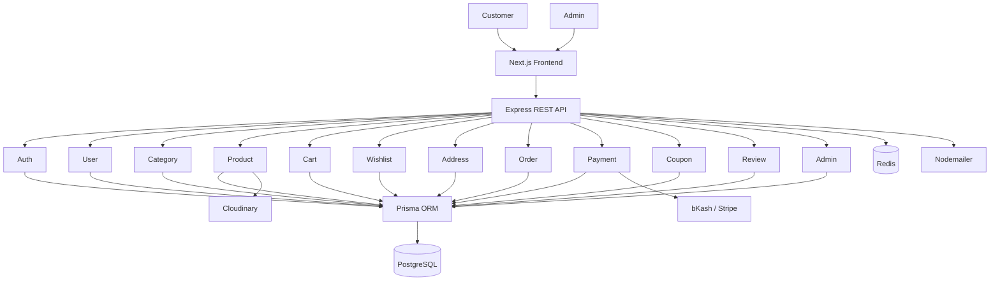

---

# 3. High-Level System Architecture

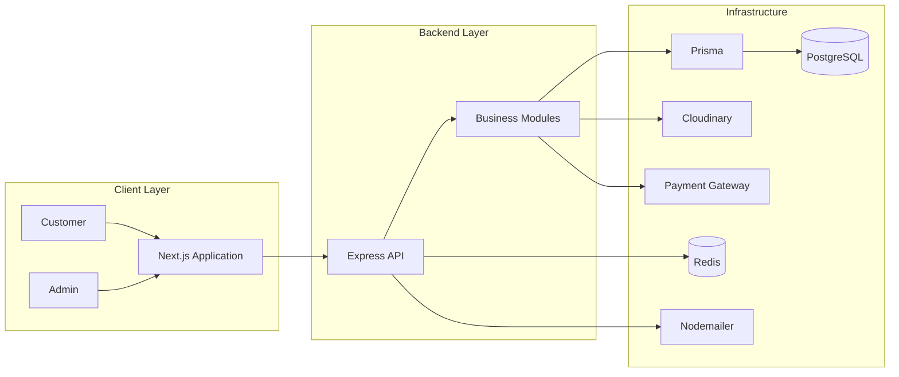

---

# 4. Frontend Architecture

Recommended Next.js structure:

```text
client/
├── app/
│   ├── (public)/
│   │   ├── page.tsx
│   │   ├── products/
│   │   ├── categories/
│   │   ├── cart/
│   │   └── checkout/
│   ├── (auth)/
│   │   ├── login/
│   │   ├── register/
│   │   ├── forgot-password/
│   │   └── reset-password/
│   ├── dashboard/
│   │   ├── profile/
│   │   ├── orders/
│   │   ├── addresses/
│   │   ├── wishlist/
│   │   └── reviews/
│   └── admin/
│       ├── dashboard/
│       ├── products/
│       ├── categories/
│       ├── orders/
│       ├── customers/
│       ├── payments/
│       ├── coupons/
│       └── reviews/
├── components/
│   ├── ui/
│   └── modules/
├── hooks/
├── lib/
├── services/
├── types/
├── providers/
└── utils/
```

The frontend should consume the backend through typed service/API functions rather than spreading raw fetch logic throughout components.

---

# 5. Backend Modular Architecture

```text
server/
├── src/
│   ├── app.ts
│   ├── server.ts
│   ├── config/
│   ├── middlewares/
│   ├── errors/
│   ├── utils/
│   ├── lib/
│   └── app/
│       └── module/
│           ├── auth/
│           ├── user/
│           ├── category/
│           ├── product/
│           ├── cart/
│           ├── wishlist/
│           ├── address/
│           ├── order/
│           ├── payment/
│           ├── coupon/
│           ├── review/
│           └── admin/
├── prisma/
│   └── schema.prisma
└── package.json
```

A typical module:

```text
product/
├── product.controller.ts
├── product.service.ts
├── product.route.ts
├── product.validation.ts
└── product.constant.ts
```

### Request Flow

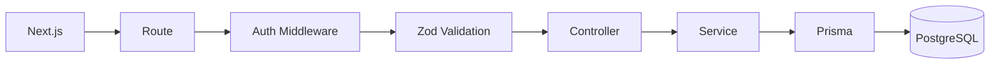

**Rule:** Controllers should stay thin. Business logic belongs in services.

---

# 6. Core Modules

## 6.1 Auth Module

Responsibilities:

- Register
- Login
- Logout
- Access token
- Refresh token
- Password hashing
- Forgot password
- Reset password
- Email verification if required
- Role-based authorization

Initial roles:

```text
CUSTOMER
ADMIN
```

A `MODERATOR` role can be added later if required.

## 6.2 User Module

Responsibilities:

- Customer profile
- Update profile
- Account status
- Customer information
- Customer order history

## 6.3 Category Module

Responsibilities:

- Create category
- Update category
- Delete category
- List categories
- Category-wise products

Relationship:

```text
Category 1 ─────── N Product
```

---

# 7. Product Architecture

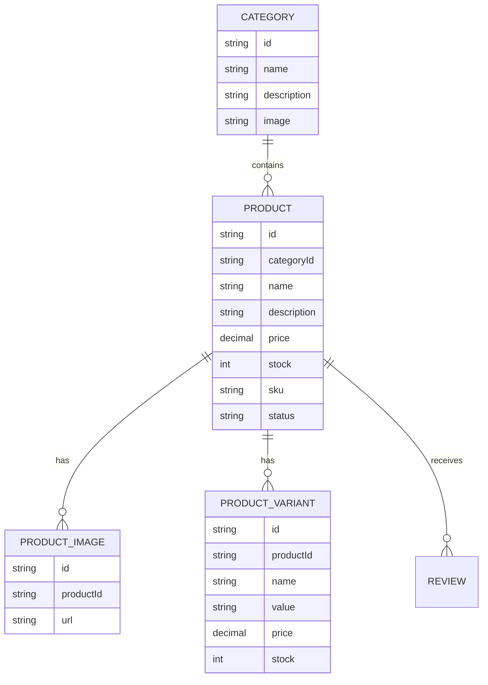

### Product Features

- Create product
- Update product
- Delete product
- Search
- Filtering
- Category filtering
- Price filtering
- Stock management
- Product images
- Product variants
- Product status

A variant is useful for products such as clothing with size/color or products with different configurations. It can be postponed for a simple MVP if necessary.

---

# 8. Cart Architecture

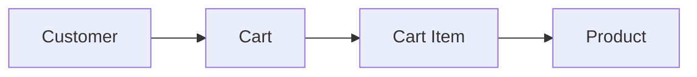

Recommended relationships:

```text
User 1 ───── 1 Cart
Cart 1 ───── N CartItem
Product 1 ── N CartItem
```

Example:

```text
Cart
├── Product A × 1
├── Product B × 2
└── Product C × 1
```

---

# 9. Wishlist Architecture

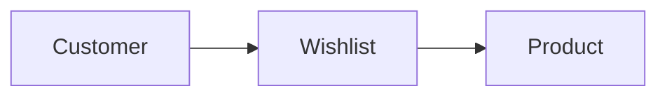

Features:

- Add product
- Remove product
- View wishlist
- Move product to cart

Wishlist can be postponed until after the core shopping flow is complete.

---

# 10. Address Architecture

A customer can save multiple delivery addresses.

```text
User
 └── Address
      ├── name
      ├── phone
      ├── division
      ├── district
      ├── area
      ├── address
      └── postalCode
```

Relationship:

```text
User 1 ───── N Address
```

---

# 11. Checkout Architecture

Checkout combines:

- Cart
- Product availability
- Customer address
- Delivery charge
- Coupon
- Order calculation
- Payment method

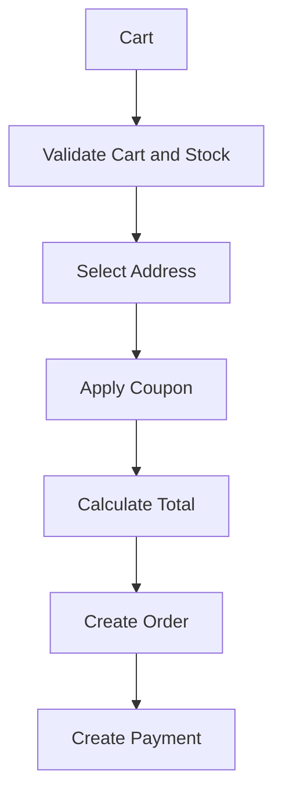

The backend must recalculate totals. Never trust price, discount, or total values sent by the browser.

---

# 12. Order Architecture

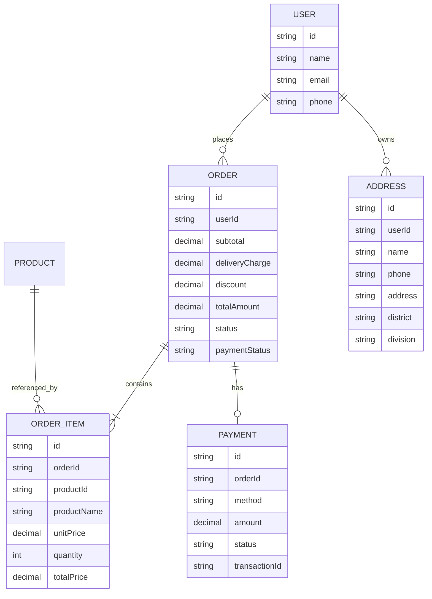

### Important Order Rule

`OrderItem` should store historical purchase information such as product name, unit price, quantity, and total price. This prevents old orders from changing when the current product price or name changes.

---

# 13. Order Lifecycle

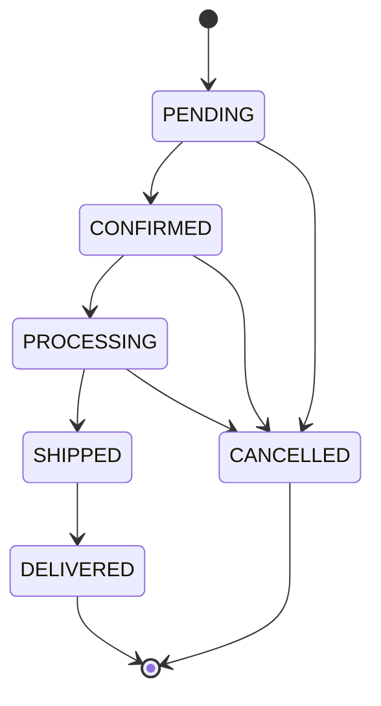

Possible future states can include `RETURN_REQUESTED`, `RETURNED`, or `REFUNDED` depending on business requirements.

---

# 14. Payment Architecture

Supported methods:

```text
COD
bKash
Stripe
```

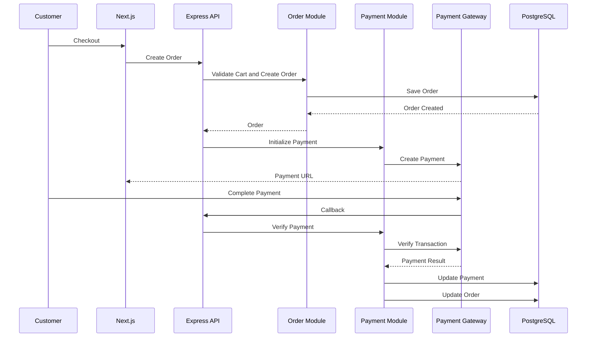

Payment statuses:

```text
PENDING
PAID
FAILED
CANCELLED
REFUNDED
```

**Important:** Never mark an order as paid based only on frontend state. The backend must verify the transaction with the payment provider.

---

# 15. Coupon Architecture

```text
Coupon
├── code
├── type
├── value
├── minimumOrderAmount
├── maximumDiscount
├── startDate
├── endDate
├── usageLimit
└── status
```

Discount types:

```text
PERCENTAGE
FIXED
```

Coupon validation must happen on the backend.

---

# 16. Review Architecture

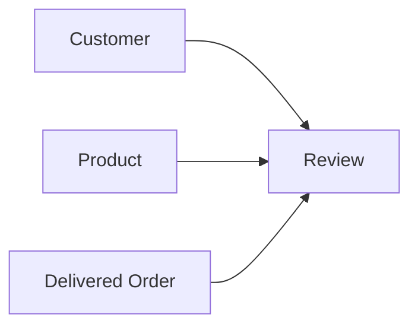

Recommended rule:

> A customer can review a product only after purchasing it and receiving the order.

---

# 17. Admin Dashboard

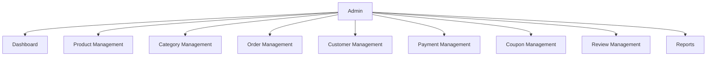

Admin responsibilities:

- Manage products
- Manage categories
- Manage inventory
- Manage customers
- Manage orders
- Update order status
- View payments
- Manage coupons
- Moderate reviews
- View reports

---

# 18. Customer Dashboard

```text
Customer Dashboard
├── Profile
├── My Orders
│   ├── Pending
│   ├── Processing
│   ├── Shipped
│   └── Delivered
├── Order Details
├── Addresses
├── Wishlist
└── Reviews
```

---

# 19. REST API Architecture

Base URL:

```text
/api/v1
```

## Auth

```text
POST   /auth/register
POST   /auth/login
POST   /auth/logout
POST   /auth/refresh-token
POST   /auth/forgot-password
POST   /auth/reset-password
GET    /auth/me
```

## Users

```text
GET    /users/me
PATCH  /users/me
GET    /users
GET    /users/:id
```

## Categories

```text
POST   /categories
GET    /categories
GET    /categories/:id
PATCH  /categories/:id
DELETE /categories/:id
```

## Products

```text
POST   /products
GET    /products
GET    /products/:id
PATCH  /products/:id
DELETE /products/:id
```

## Cart

```text
GET    /cart
POST   /cart/items
PATCH  /cart/items/:id
DELETE /cart/items/:id
DELETE /cart
```

## Orders

```text
POST   /orders
GET    /orders
GET    /orders/:id
PATCH  /orders/:id/status
POST   /orders/:id/cancel
```

## Payments

```text
POST   /payments
GET    /payments/:id
POST   /payments/:id/verify
POST   /payments/callback
```

## Coupons

```text
POST   /coupons
GET    /coupons
PATCH  /coupons/:id
DELETE /coupons/:id
POST   /coupons/validate
```

## Reviews

```text
POST   /reviews
GET    /reviews/product/:productId
PATCH  /reviews/:id
DELETE /reviews/:id
```

---

# 20. Database Overview

Initial core models:

```text
User
Address
Category
Product
ProductImage
ProductVariant
Cart
CartItem
Wishlist
Order
OrderItem
Payment
Coupon
Review
```

Core relationships:

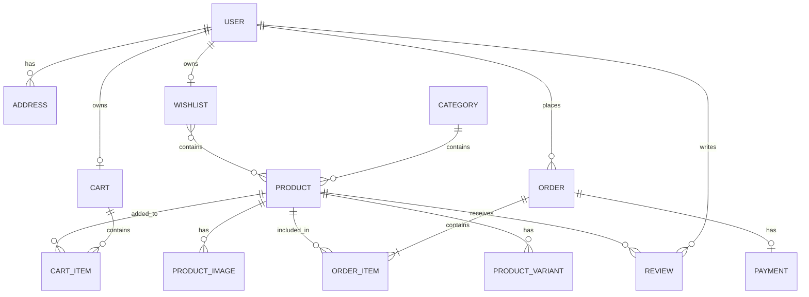

---

# 21. Image and File Management

Product and user images should not be stored directly in PostgreSQL.

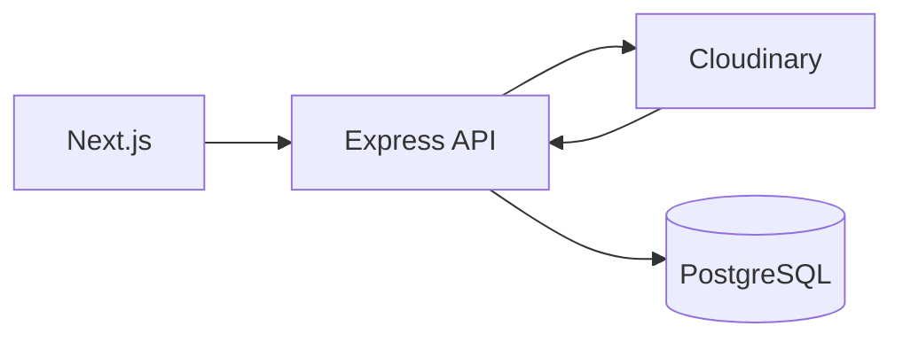

PostgreSQL stores the image URL/public identifier. Cloudinary stores the actual file.

---

# 22. Redis

Redis is optional for the first MVP and can later be used for:

- OTP
- Temporary sessions
- Rate limiting
- Frequently accessed data
- Caching
- Temporary payment/session data

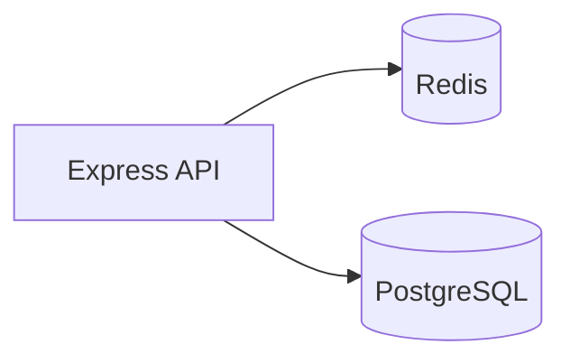

PostgreSQL remains the source of truth for permanent business data.

---

# 23. Complete Customer Purchase Flow

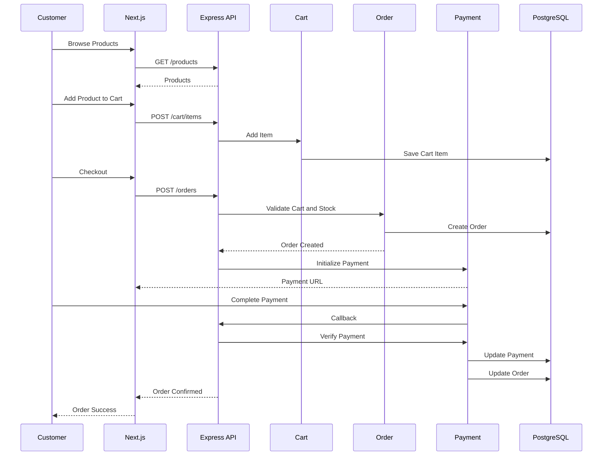

---

# 24. Security Architecture

The API should implement:

- JWT authentication
- Refresh token security
- Password hashing
- Role-based authorization
- Zod validation
- Rate limiting
- CORS configuration
- Secure HTTP headers
- Input validation/sanitization
- Centralized error handling
- Payment verification
- File upload validation
- Environment variable protection

Never commit secrets to Git.

```text
.env
.env.local
```

should be included in `.gitignore`.

---

# 25. Standard API Response

Success:

```json
{
  "success": true,
  "message": "Product retrieved successfully",
  "data": {}
}
```

Error:

```json
{
  "success": false,
  "message": "Product not found",
  "data": null
}
```

---

# 26. Error Handling

Use centralized error handling.

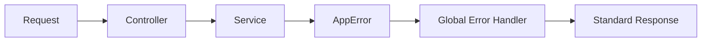

---

# 27. Development Phases

## Phase 1 — Foundation

```text
Project setup
Next.js
Express
TypeScript
Prisma
PostgreSQL
Environment configuration
Error handling
API response structure
```

## Phase 2 — Authentication

```text
Register
Login
Logout
JWT
Refresh token
Role authorization
Profile
```

## Phase 3 — Product Catalog

```text
Category
Product
Product images
Search
Filtering
Product variants
Inventory
```

## Phase 4 — Shopping

```text
Cart
Cart items
Wishlist
Address
```

## Phase 5 — Order

```text
Checkout
Order
Order items
Order status
Stock update
```

## Phase 6 — Payment

```text
COD
bKash
Stripe
Payment initialization
Payment verification
Payment callback
Refund
```

## Phase 7 — Customer Dashboard

```text
Profile
Orders
Order details
Addresses
Wishlist
Reviews
```

## Phase 8 — Admin Dashboard

```text
Dashboard
Products
Categories
Orders
Customers
Payments
Coupons
Reviews
Reports
```

## Phase 9 — Optimization

```text
Redis
Caching
Rate limiting
Performance optimization
Logging
Monitoring
Testing
```

---

# 28. Recommended Development Order

Do not build everything at once.

```text
Foundation
    ↓
Authentication
    ↓
User
    ↓
Category
    ↓
Product
    ↓
Cart
    ↓
Address
    ↓
Checkout
    ↓
Order
    ↓
Payment
    ↓
Customer Dashboard
    ↓
Admin Dashboard
    ↓
Coupon
    ↓
Review
    ↓
Wishlist
    ↓
Redis / Optimization
```

---

# 29. Important Architecture Principles

## 1. Modular Monolith First

Start with one backend application and clear module boundaries.

```text
One Backend
├── Auth
├── User
├── Category
├── Product
├── Cart
├── Order
├── Payment
├── Coupon
├── Review
├── Wishlist
├── Address
└── Admin
```

## 2. Keep Responsibilities Separate

Product logic belongs in Product. Order logic belongs in Order. Payment logic belongs in Payment.

## 3. Keep Controllers Thin

```text
Route
  ↓
Middleware
  ↓
Controller
  ↓
Service
  ↓
Prisma
  ↓
Database
```

## 4. Database Is the Source of Truth

Permanent business data belongs in PostgreSQL.

## 5. Payment Must Be Verified

Never mark an order as paid based only on frontend state.

## 6. Do Not Over-Engineer

Do not introduce microservices, Kafka, Kubernetes, or multiple backend services until there is a real business or scaling requirement.

---

# 30. Final Architecture

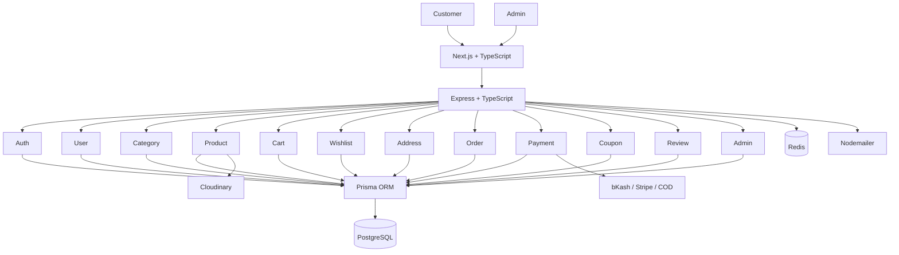

---

# Conclusion

This architecture provides a clean starting point for a professional e-commerce platform using:

**Next.js → Express → Prisma → PostgreSQL**

with supporting services:

**Redis → Cloudinary → Payment Gateway → Nodemailer**

The platform starts as a **Modular Monolith**, which keeps development and deployment simple while maintaining clear module boundaries for future scaling.

Microservices should only be introduced later when independent scaling, deployment, or team ownership creates a real need.
